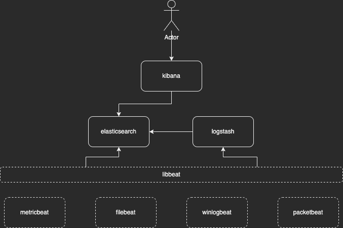

# Monitoring Docker Compose

## Requirements

 - https://www.docker.com/

## Diagram



## Init

Start

```
$ docker compose up -d
```

Stop

```
$ docker compose stop
```

> If Operative System is Linux:
> ```
> $ sudo chmod 777 -R data
> ```

## Fleet Server

Once deployed it is necessary to look for the secret token:
Management - Fleet - Enrollment Tokens - Secret Column

Then fill in the FLEET_ENROLLMENT_TOKEN tag of the elk-fleet service in the docker-compose.yml file.

```
$ docker compose up -d elk-fleet
```

### URLs
* [Kibana](http://localhost:5601)

## Documentation
 * https://www.elastic.co/es/